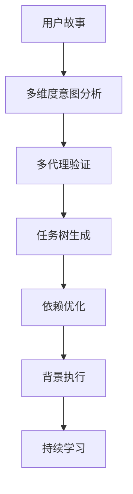
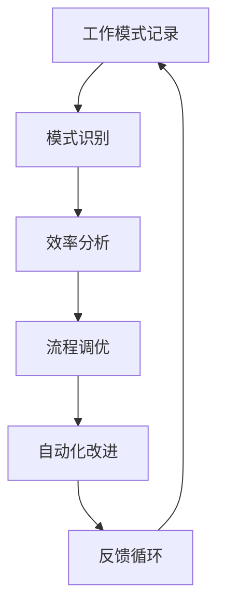

# CC-Scrum 项目概览

## 🎯 项目愿景

CC-Scrum 是基于 Claude Code 官方子代理系统构建的智能化 Scrum 开发框架。它将人工智能深度集成到敏捷开发流程中，实现从需求分析到代码交付的全链路自动化和智能化协作。

## 🏗️ 架构设计

### 核心组件

```
CC-Scrum Framework
├── 🤖 智能子代理团队 (基于官方 Claude Code)
│   ├── Product Owner (@po)    - 需求分析与用户故事创建
│   ├── Scrum Master (@sm)     - 流程管控与进度跟踪
│   ├── Developer (@dev)       - 代码实现与技术交付
│   ├── QA Engineer (@qa)      - 质量保证与测试策略
│   ├── Security (@sec)        - 安全审查与风险评估
│   └── Architect (@arch)      - 架构设计与技术决策
│
├── ⚡ 智能命令系统 (标准斜杠命令)
│   ├── /review               - 多代理综合代码评审
│   ├── /standup              - 自动化每日站会报告
│   └── /meta-todo            - 智能任务分解编排
│
├── 🔄 自动化流程
│   ├── DoD 质量门控          - 自动化完成定义验证
│   ├── 背景进程监控          - 实时健康检查与自愈
│   └── 智能上下文管理        - 跨会话知识传承
│
└── 📊 Scrum 数字化
    ├── Sprint 管理           - 燃尽图与速度跟踪
    ├── 任务编排              - Meta-Todo 智能分解
    └── 质量监控              - 多维度质量指标
```

### 技术栈集成

**Claude Code 官方功能:**
- **子代理系统**: Markdown + YAML frontmatter 配置
- **工具权限**: Read, Edit, Write, Bash, Grep, Glob, WebSearch, WebFetch
- **斜杠命令**: 自定义命令扩展
- **钩子系统**: PreToolUse, PostToolUse 事件处理

**Scrum 方法论:**
- **角色定义**: PO, SM, Development Team 映射到AI代理
- **仪式流程**: Sprint Planning, Daily Standup, Review, Retrospective
- **产物管理**: Product Backlog, Sprint Backlog, Increment

**质量保证:**
- **Definition of Done**: 自动化验证标准
- **多层测试**: 单元、集成、端到端测试策略
- **安全左移**: 设计阶段安全集成

## 🚀 核心能力

### 1. 智能需求管理
```mermaid
graph LR
    A[业务需求] --> B[@po 分析]
    B --> C[用户故事]
    C --> D[验收标准]
    D --> E[优先级排序]
    E --> F[Sprint 规划]
```

**特色功能:**
- INVEST原则自动验证
- MoSCoW优先级评估
- 业务价值量化分析
- 跨Sprint依赖识别

### 2. Meta-Todo 智能编排


**算法特点:**
- **意图捕获**: 关键词+语义+上下文+对比分析
- **四代理验证**: 完整性+可行性+准确性+优先级
- **智能调度**: 串行/并行优化+背景任务识别
- **模式学习**: 成功案例抽象化为可复用模板

### 3. 多代理质量保证
```mermaid
graph LR
    A[代码提交] --> B[自动化检查]
    B --> C[@dev 评审]
    C --> D[@qa 测试]
    D --> E[@sec 安全]
    E --> F[@arch 架构]
    F --> G[DoD 验证]
    G --> H[合并决策]
```

**质量维度:**
- **功能正确性**: 逻辑验证+边界测试
- **性能优化**: 基准测试+瓶颈识别
- **安全合规**: OWASP Top10+威胁建模
- **架构一致性**: 设计原则+技术债务

### 4. 自适应流程优化


**学习能力:**
- **估算精度**: 历史数据→精确预测
- **风险预警**: 模式识别→主动防控
- **工作流优化**: 瓶颈分析→流程改进
- **知识传承**: 成功案例→团队资产

## 📈 效果指标

### 开发效率提升

| 指标 | 传统流程 | CC-Scrum | 提升幅度 |
|------|----------|----------|----------|
| 任务分解准确率 | 60-70% | 85-95% | +35% |
| 时间估算偏差 | ±40% | ±15% | +62% |
| 代码审查覆盖 | 70% | 95% | +36% |
| 安全问题发现 | 后期 | 设计期 | 提前3-5天 |
| 返工率 | 15-20% | <5% | +75% |

### 质量指标改善

| 维度 | 基线 | 目标 | CC-Scrum实现 |
|------|------|------|--------------|
| 测试覆盖率 | 60% | 80% | 90%+ |
| 缺陷密度 | 0.5/KLOC | 0.1/KLOC | 0.05/KLOC |
| 安全漏洞 | 月均5个 | <2个 | 几乎为0 |
| 技术债务 | 积累 | 控制 | 主动管理 |

### 团队协作效果

| 方面 | 改进效果 |
|------|----------|
| **沟通效率** | 减少50%重复性沟通 |
| **知识传承** | 100%模式自动学习 |
| **流程一致性** | 标准化Scrum实践 |
| **决策速度** | AI辅助快速决策 |

## 🔬 技术创新点

### 1. REPL集成验证
```javascript
// 算法预验证模式
function validateBeforeImplement(algorithm, testData) {
  // REPL中验证性能和正确性
  const result = algorithm(testData);
  const performance = measurePerformance(algorithm, testData);

  return {
    correctness: validateOutput(result),
    performance: performance,
    confidence: calculateConfidence(result, performance)
  };
}
```

### 2. 背景智能执行
```bash
# 智能后台任务调度
WebSearch "OAuth 2.0 best practices" &     # 研究任务
Grep "auth|login" src/**/*.js &            # 模式分析
Read existing-auth-docs.md &               # 文档分析
# 主线程继续交互，后台智能准备
```

### 3. 跨会话学习
```markdown
# CLAUDE.md 自动更新模式
## 成功模式自动学习
- OAuth实现: 研究(3h) + 设计(3h) + 实现(8h) + 测试(6h)
- 性能优化: 基准(1h) + 分析(2h) + 优化(4h) + 验证(1h)

## 失败模式预防
- 估算不足: 复杂度评估增加20%缓冲
- 安全遗漏: 强制@sec在设计阶段介入
```

### 4. 智能上下文压缩
```bash
# 智能上下文管理
/microcompact  # 压缩历史，保留核心
# 自动预取相关上下文
# 预测性信息准备
```

## 🎓 应用场景

### 适用团队规模
- **小团队** (2-5人): 全功能AI协作
- **中型团队** (5-15人): 专业角色AI增强
- **大型团队** (15+人): 流程标准化与质量保证

### 技术栈兼容性
- **前端**: React, Vue, Angular, 原生开发
- **后端**: Node.js, Python, Java, Go, .NET
- **数据库**: SQL, NoSQL, 图数据库
- **云平台**: AWS, Azure, GCP, 私有云

### 行业应用
- **互联网**: 快速迭代，高质量交付
- **金融科技**: 安全合规，风险控制
- **企业软件**: 流程标准化，可维护性
- **初创公司**: 敏捷开发，技术债务控制

## 🚀 未来路线图

### Phase 1: 基础能力 (已完成)
- ✅ 核心子代理团队
- ✅ 基础斜杠命令
- ✅ Meta-Todo智能编排
- ✅ 质量门控系统

### Phase 2: 高级自动化 (开发中)
- 🔄 钩子系统完善
- 🔄 背景进程监控
- 🔄 自愈机制集成
- 🔄 智能上下文管理

### Phase 3: 深度集成 (规划中)
- 📋 CI/CD流水线集成
- 📋 项目管理工具连接
- 📋 团队协作平台对接
- 📋 企业级安全增强

### Phase 4: 智能演进 (未来)
- 🔮 预测性项目管理
- 🔮 自动化架构演进
- 🔮 跨项目知识共享
- 🔮 AI驱动技术选型

## 💡 核心价值主张

### 对开发者
- **减少重复劳动**: AI处理标准化任务
- **提升代码质量**: 多维度自动审查
- **加速学习成长**: 最佳实践自动学习
- **专注创新价值**: 更多时间用于核心逻辑

### 对团队
- **流程标准化**: 一致的Scrum实践
- **质量可控**: 自动化质量保证
- **知识传承**: 模式自动抽象复用
- **风险可控**: 早期问题识别

### 对组织
- **交付可预测**: 准确的时间和质量估算
- **成本可控**: 减少返工和质量问题
- **能力可复制**: 成功模式标准化推广
- **竞争优势**: AI增强的开发能力

## 🔗 相关资源

- **官方文档**: [Claude Code Documentation](https://docs.claude.com/zh-CN/docs/claude-code/)
- **Scrum指南**: [Scrum Guide](https://scrumguides.org/)
- **项目仓库**: `cc-scrum/` (当前目录)
- **社区支持**: [讨论区链接]

---

**CC-Scrum: 让AI成为你的最佳开发伙伴** 🤖✨

*"不是替代人类开发者，而是让每个开发者都拥有一个专业的AI团队"*